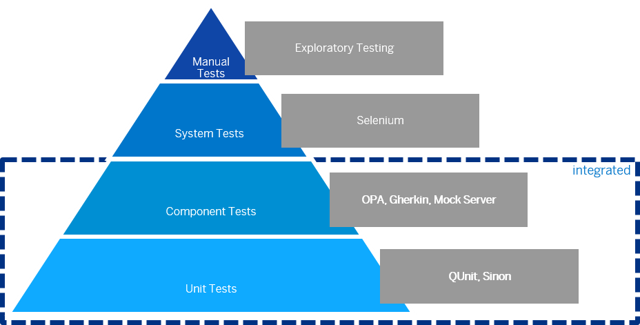

# UI5-Testing

This repository is meant to serve as example for how testing works within UI5. It is basically what happens when you work through the entire "Testing"-Section within the official [UI5 documentation](https://sapui5.hana.ondemand.com/#/topic/291c9121e6044ab381e0b51716f97f52).

### Preview


### Testing Pyramid



# Getting Started
You can just clone this repository, run npm install and use the [UI5 tooling](https://github.com/SAP/ui5-tooling) to locally serve the application in order to debug/learn from it.

Hint: it already uses the livereload-middleware for the [UI5 tooling](https://github.com/SAP/ui5-tooling), so changes while serving will trigger an immediate update in the browser.

1. Clone the repository
    ```sh
    git clone <repository-url>
    ```
1. Navigate into the cloned repository 
    ```sh
    cd <repository>
    ```
1. Install all dependencies
    ```sh
    npm install
    ```
1. Start the application
    ```sh
    npm start
    ```
## Namespace & Projectname

The paths within this project are - as usual - prefixed by the `projectId` ( which is declared within the `manifest.json` file). The prefix is made up by a given namespace and the name of the project. I must admit that the project name is quite verbose.

* Namespace: `com.mrb`
* Projectname: `UI5-Testing`


# Tutorial Steps

* Step 1: Overview and Testing Strategy :white_check_mark: [0ebd475](https://github.com/SAPMarco/UI5-testing/commit/0ebd475e74be1b46fe3678decf5b20a614f0e715)
* Step 2: A First Unit Test
* Step 3: Adding the Price Formatter
* Step 4: Testing a New Module
* Step 5: Adding a Flag Button
* Step 6: A First OPA Test
* Step 7: Changing the Table to a Growing Table
* Step 8: Testing Navigation
* Step 9: Adding the Post Page
* Step 10: Test Suite and Automated Testing
* Step 11: Testing User Input
* Step 12: Adding a Search
* Step 13: Testing User Interaction
* Step 14: Adding Tabs
* Step 15: Writing a Short Date Formatter Using TDD
* Step 16: Adding the Date Formatter

Implemented = :white_check_mark:

# Additional Information

## OData-Service 'settings'

When declaring the OData-Service as our model, we have added the parameter `metadataUrlParams` like so:

```json
"sap.app": {
    "dataSources": {
      "mainService": {
        "uri": "/here/goes/your/serviceUrl/",
        "type": "OData",
        "settings": {
          "odataVersion": "2.0",
          "localUri": "localService/metadata.xml"
        }
      }
    }
  },
"models": {
      "": {
        "dataSource": "mainService",
        "settings": {
          "metadataUrlParams": {
            "sap-documentation": "heading"
          }
        }
      }
    }
``` 

This results in a GET-Request that looks like the following:

```
http://localhost:8080/here/goes/your/serviceUrl/$metadata?sap-documentation=heading&sap-language=EN 
```

# Credits

For more information check:

* [UI5 Documentation](https://sapui5.hana.ondemand.com/#/topic/291c9121e6044ab381e0b51716f97f52)
* [Getting Started](https://sapui5.hana.ondemand.com/#/topic/8b49fc198bf04b2d9800fc37fecbb218.html)
* [Each Step as Download](https://sapui5.hana.ondemand.com/#/entity/sap.m.tutorial.testing)
* [Test Automation](https://sapui5.hana.ondemand.com/#/topic/ae448243822448d8ba04b4784f4b09a0.html#loioae448243822448d8ba04b4784f4b09a0)
* [Mock Server](https://sapui5.hana.ondemand.com/#/topic/69d3cbd4150c4ffb884e788f7f60fd93)
* [Test Recorder](https://sapui5.hana.ondemand.com/#/topic/2535ef9272064cb6bd6b44e5402d531d)
* [OPA5](https://sapui5.hana.ondemand.com/#/topic/2696ab50faad458f9b4027ec2f9b884d)
* [QUNIT](https://sapui5.hana.ondemand.com/#/topic/09d145cd86ee4f8e9d08715f1b364c51)